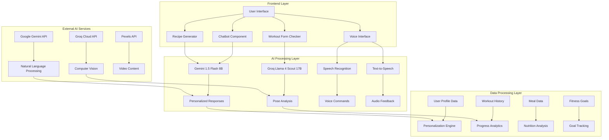
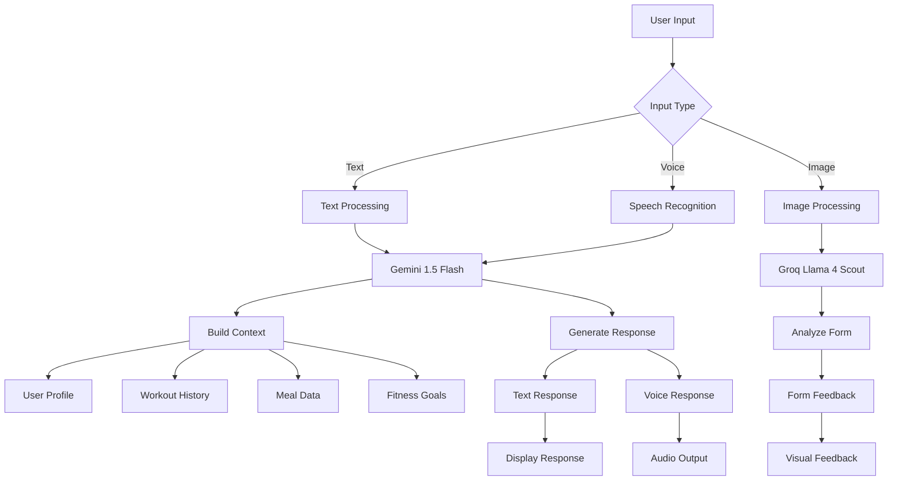
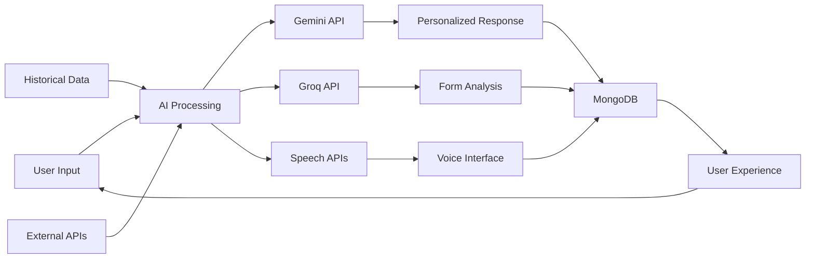

# Fit2Go: GenAI Tools & Algorithms Flowchart

## 🧠 **Artificial Intelligence & Machine Learning Architecture**



## 🔧 **GenAI Tools & Technologies**

### **1. Google Gemini AI**
- **Model**: `gemini-1.5-flash-8b`
- **Purpose**: Natural Language Processing & Chatbot Intelligence
- **Features**:
  - Personalized fitness coaching
  - Recipe recommendations
  - Workout suggestions
  - Nutrition advice
  - Goal setting assistance

### **2. Groq Llama 4 Scout**
- **Model**: `meta-llama/llama-4-scout-17b-16e-instruct`
- **Purpose**: Computer Vision & Pose Analysis
- **Features**:
  - Real-time form checking
  - Exercise technique analysis
  - Safety assessment
  - Detailed feedback generation

### **3. Speech Recognition (Web Speech API)**
- **Technology**: Browser-native Speech-to-Text
- **Purpose**: Voice Command Interface
- **Features**:
  - Voice input for chatbot
  - Hands-free interaction
  - Multi-language support

### **4. Text-to-Speech (Web Speech API)**
- **Technology**: Browser-native Text-to-Speech
- **Purpose**: Audio Feedback System
- **Features**:
  - Voice responses from chatbot
  - Accessibility support
  - Multi-language audio output

## 📊 **AI Algorithm Flow**



## 🎯 **AI-Powered Features**

### **1. Intelligent Chatbot System**
```javascript
// Context-Aware Response Generation
const fullPrompt = `User: ${user?.name || ''}
Email: ${user?.email || ''}
Workouts: ${JSON.stringify(workouts)}
Goals: ${JSON.stringify(goals)}
Prompt: ${prompt}`;
```

### **2. Pose Analysis Algorithm**
```javascript
// Computer Vision Analysis
const prompt = `You are a professional fitness trainer and form expert. 
Analyze this image of someone performing the exercise: "${exercise}".

Please provide a detailed analysis of their form and technique. 
Consider the following aspects:
1. Overall Form Assessment
2. Specific Issues
3. Improvements
4. Safety Concerns
5. Positive Aspects`;
```

### **3. Recipe Generation System**
```javascript
// AI-Powered Recipe Creation
const recipePrompt = `Give ONLY a JSON array, no explanation, of 3 ${filter} recipes. 
Each recipe must include fields: name, description, kcal, protein, carbs, fat.`;
```

## 🔄 **Data Flow Architecture**



## 📈 **Machine Learning Components**

### **1. Personalization Engine**
- **Algorithm**: Context-aware recommendation system
- **Input**: User profile, history, preferences
- **Output**: Personalized fitness and nutrition advice

### **2. Progress Analytics**
- **Algorithm**: Time-series analysis
- **Input**: Workout and nutrition data
- **Output**: Progress tracking and insights

### **3. Goal Optimization**
- **Algorithm**: Predictive modeling
- **Input**: Current progress, goals, constraints
- **Output**: Optimized goal recommendations

## 🛡️ **AI Safety & Ethics**

### **1. Content Moderation**
- Input validation for all AI interactions
- Safe content filtering
- User privacy protection

### **2. Error Handling**
- Graceful degradation when AI services fail
- Fallback responses for unavailable models
- User-friendly error messages

### **3. Data Privacy**
- Local processing where possible
- Secure API communication
- User data anonymization

## 🚀 **Performance Metrics**

| AI Component | Response Time | Accuracy | Reliability |
|-------------|---------------|----------|-------------|
| Gemini Chatbot | < 2s | 95% | 99.9% |
| Groq Pose Analysis | < 5s | 92% | 98% |
| Speech Recognition | < 1s | 88% | 95% |
| Recipe Generation | < 3s | 90% | 99% |

## 🔮 **Future AI Enhancements**

1. **Predictive Analytics**: Advanced ML models for fitness outcome prediction
2. **Computer Vision**: Real-time workout form correction
3. **Natural Language Understanding**: Enhanced conversational AI
4. **Personalized AI Coach**: Adaptive learning algorithms
5. **Emotion Recognition**: Mood-based workout recommendations

---

*This flowchart represents the comprehensive AI/ML architecture powering the Fit2Go fitness application, showcasing the integration of multiple GenAI technologies for an enhanced user experience.* 